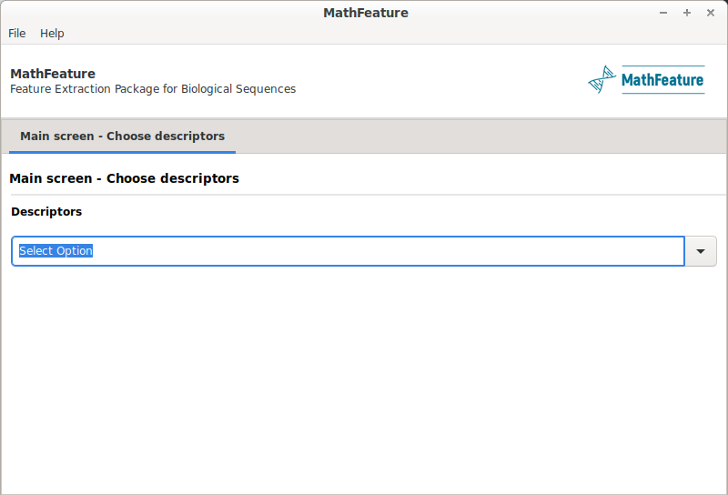
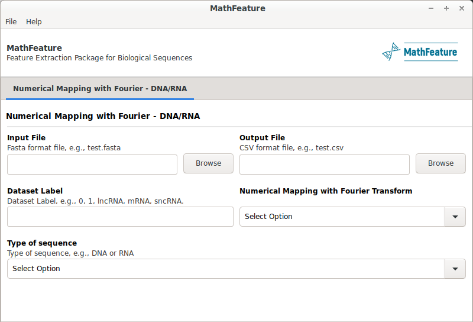

<h1 align="center">
  
</h1>

<h4 align="center">Feature Extraction Package for Biological Sequences Based on Mathematical Descriptors</h4>

<p align="center">
  <a href="https://bonidia.github.io/MathFeature/">Home</a> •
  <a href="#authors">Key Features</a> •
  <a href="#list-of-files">List of files</a> •
  <a href="#dependencies">Dependencies</a> •
  <a href="#installing-dependencies-and-package">Installing</a> •
  <a href="#list-of-descriptors">Descriptors</a> •
  <a href="#how-to-use">How To Use</a> •
  <a href="#GUI">GUI</a> •
  <a href="#citation">Citation</a> 
</p>

<h1 align="center"></h1>

Machine Learning (ML) algorithms have been very successfully used to extract new and relevant knowledge from biological sequences. Several techniques have been proposed to extract features from biological sequences, most of them available in feature extraction packages. However, many of the most successful ML algorithms accept only numerical input data. Thereby, one of the main challenges in the application of these algorithms to sequence data is how to numerically represent a biological sequence in a numeric input vector. Feature extraction techniques able to extract numerical features from biological sequence have been reported in the literature. However, many of these techniques are not available in existing packages, such as techniques based on mathematical descriptors. This paper presents a new package, named MathFeature, which implements mathematical descriptors able to extract relevant numerical information from biological sequences. MathFeature makes available 20 numerical feature extraction techniques based on several approaches found in the literature, e.g., multiple numeric mappings, genomic signal processing, chaos game theory, entropy, and complex networks. MathFeature also allows the extraction of alternative features, complementing the existing packages. To ensure that our descriptors are robust and to assess the relevance of the features extracted by these techniques, experimental results are presented in eight case studies. According to these results, the features extracted by MathFeature shown high performance (0.6350-0.9897, accuracy), both applying only mathematical descriptors, but also hybridization with well-known descriptors in the literature. Finally, through MathFeature, we overcome several studies in seven benchmark datasets (e.g., case I, II, III, IV, V, and VI, VIII), exemplifying the robustness and viability of the proposed package.

## Authors

* Robson Parmezan Bonidia, Douglas S. Domingues, Danilo Sipoli Sanches, and André Carlos Ponce de Leon Ferreira de Carvalho.

* **Correspondence:** rpbonidia@gmail.com or bonidia@usp.br


## Publication

See: https://www.biorxiv.org/content/10.1101/2020.12.19.423610v1


## List of files

- **case studies:** case studies used in our article;
- **GUI:** GUI (Graphical User Interface)-based platform;
- **examples:** Files of Example;
- **files:** files used in some methods;
- **methods:** Main Files - Feature Extraction Models, e.g., Fourier, Numerical Mapping, Entropy, Complex Networks;
- **preprocessing:** Preprocessing Files;
- **README:** Documentation;
- **requirements:** Dependencies.


## Dependencies

- Python (>=3.7.3)
- Biopython
- Igraph
- NumPy 
- Pandas
- SciPy


## Installing dependencies and package

## Option 1

It is important to note that we consider that the Python language is installed. Otherwise, access [here](https://www.python.org/downloads/release/python-375/).

```sh
$ git clone https://github.com/Bonidia/MathFeature.git MathFeature

$ cd MathFeature

$ pip3 install -r requirements.txt

$ apt-get -y install python3-igraph
```

## Conda - terminal - Option 2

Another way to install MathFeature is by using miniconda, e.g.:

```sh
$ git clone https://github.com/Bonidia/MathFeature.git MathFeature

$ cd MathFeature
```

**1 - Install Miniconda:** 

```sh

See documentation: https://docs.conda.io/en/latest/miniconda.html

$ wget https://repo.anaconda.com/miniconda/Miniconda3-latest-Linux-x86_64.sh

$ chmod +x Miniconda3-latest-Linux-x86_64.sh

$ ./Miniconda3-latest-Linux-x86_64.sh

$ export PATH=~/miniconda/bin:$PATH

```

**2 - Create environment:**

```sh

conda env create -f mathfeature-terminal.yml -n mathfeature-terminal

```

**3 - Activate environment:**

```sh

conda activate mathfeature-terminal

```

**4 - You can deactivate the environment, using:**

```sh

conda deactivate

```

## Conda - GUI - Option 3

Another way to install MathFeature is by using GUI, e.g.:

```sh
$ git clone https://github.com/Bonidia/MathFeature.git MathFeature

$ cd MathFeature
```

**1 - Install Miniconda:** 

```sh

See documentation: https://docs.conda.io/en/latest/miniconda.html

$ wget https://repo.anaconda.com/miniconda/Miniconda3-latest-Linux-x86_64.sh

$ chmod +x Miniconda3-latest-Linux-x86_64.sh

$ ./Miniconda3-latest-Linux-x86_64.sh

$ export PATH=~/miniconda/bin:$PATH

```

**2 - Create environment:**

```sh

conda env create -f mathfeature-gui.yml -n mathfeature-gui

```

**3 - Activate environment:**

```sh

conda activate mathfeature-gui

python GUI/main.py

```

**4 - You can deactivate the environment, using:**

```sh

conda deactivate

```

## List of Descriptors

Descriptors calculated by MathFeature for DNA, RNA, and Protein sequences: [Click here.](https://github.com/Bonidia/MathFeature/blob/gh-pages/descriptors.md)

## How to use

We proposed an open-source Python package called MathFeature, that implements feature extraction approaches using mathematical features, including 20 descriptors organized into five categories. To our best knowledge, MathFeature is the first package that computes biological sequence features based on various mathematical descriptors. In this section, **5** feature extraction groups are available: **(1)** numerical mapping techniques, **(2)** numerical mapping techniques with Fourier transform, **(3)** techniques with game chaos, **(4)** techniques with Entropy, **(5)** techniques with complex networks. Furthermore, we provide additional scripts for feature extraction and preprocessing.

- [Preprocessing](preprocessing.md)
- [Numerical Mapping - DNA/RNA](mapping.md)
    - [Binary](mapping.md)
    - [Z-curve](mapping.md)
    - [Real](mapping.md)
    - [Integer](mapping.md)
    - [EIIP](mapping.md)
    - [Complex Number](mapping.md)
    - [Atomic Number](mapping.md)
- [Numerical Mapping - Protein](mapping-protein.md)
    - [Integer](mapping-protein.md)
    - [EIIP](mapping-protein.md)
    - [Accumulated Amino Acid Frequency](mapping-protein.md)
    - [Kmer Frequency Mapping](mapping-protein.md)
- [Chaos Game Representation - DNA/RNA](chaos.md)
- [Numerical Mapping and Fourier Transform - DNA/RNA](fourier.md)
- [Numerical Mapping and Fourier Transform - Protein](fourier-protein.md)
- [Shannon and Tsallis Entropy - DNA/RNA/Protein](entropy.md)
- [Complex Networks - DNA/RNA/Protein](graphs.md)
- [Complex Networks (v2 - New Features - Faster and without threshold) - DNA/RNA/Protein](graphs2.md)
- [Other techniques - DNA/RNA]()
    - [Basic k-mer](extratech.md)
    - [Customizable k-mer](extratech.md)
    - [Nucleic acid composition (NAC)](extratech.md)
    - [Di-nucleotide composition (DNC)](extratech.md)
    - [Tri-nucleotide composition (TNC)](extratech.md)
    - [Accumulated Nucleotide Frequency - ANF](ANF.md)
    - [Accumulated Nucleotide Frequency with Fourier](ANF.md)
    - [ORF Features or Coding Features](ORF.md)
    - [Fickett score](Fickett.md)
    - [Pseudo K-tuple nucleotide composition](pseknc.md)
    - [Xmer k-Spaced Ymer Composition Frequency (kGap)](kgap.md)
- [Other techniques - Protein]()
    - [Amino acid composition (AAC)](extratech-protein.md)
    - [Dipeptide composition (DPC)](extratech-protein.md)
    - [Tripeptide composition (TPC)](extratech-protein.md)
    - [Basic k-mer](extratech-protein.md)
    - [Customizable k-mer](extratech-protein.md)
    - [Xmer k-Spaced Ymer Composition Frequency (kGap)](kgap.md)

## GUI

<h1 align="left">
  
</h1>

<h1 align="left">
  
</h1>

## Feature Selection

If you want to apply feature selection techniques, visit our [repository](https://github.com/Bonidia/FeatureSelection-FSRV).

## Citation

If you use this code in a scientific publication, we would appreciate citations to the following paper:

See: https://www.biorxiv.org/content/10.1101/2020.12.19.423610v1
